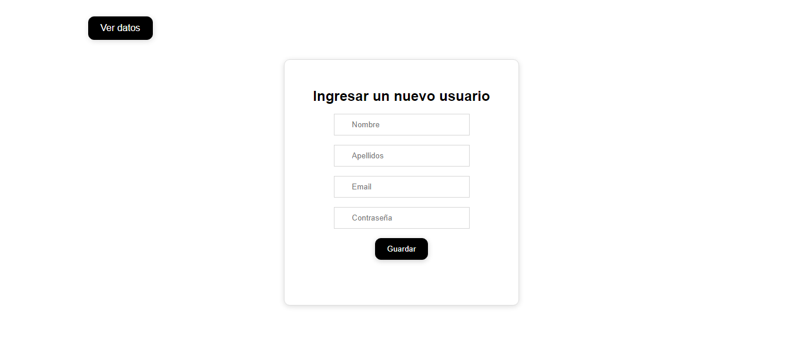
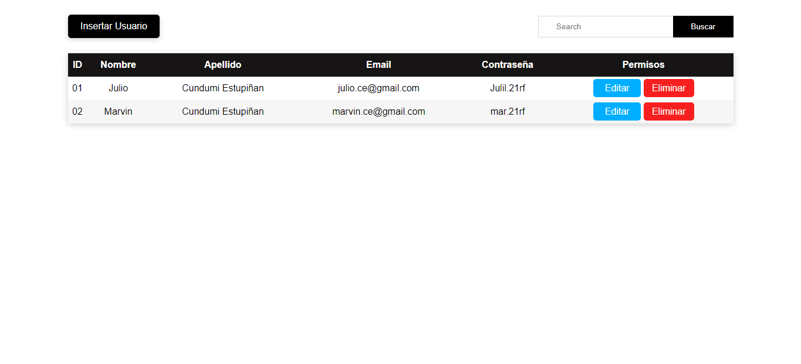
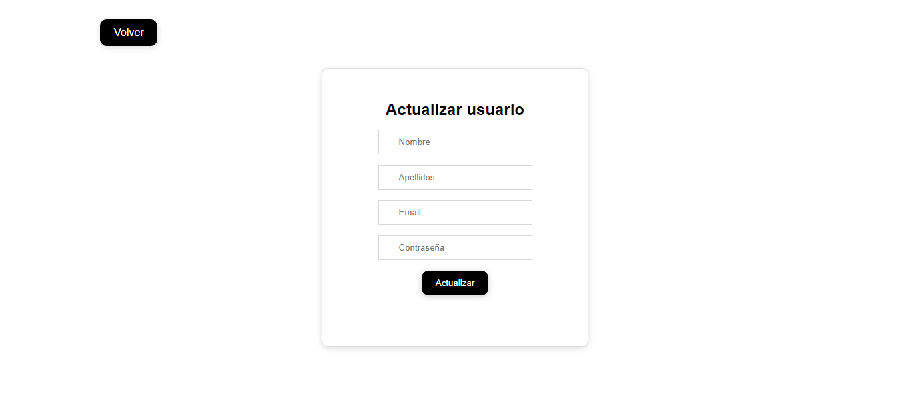

# Crud project - (Frontedn) - using vanilla js
- this is a basic project to put into practice my current knowledge of javascript, specifically ajax.

## Frontend
- html
- css
- javascript
- sass

